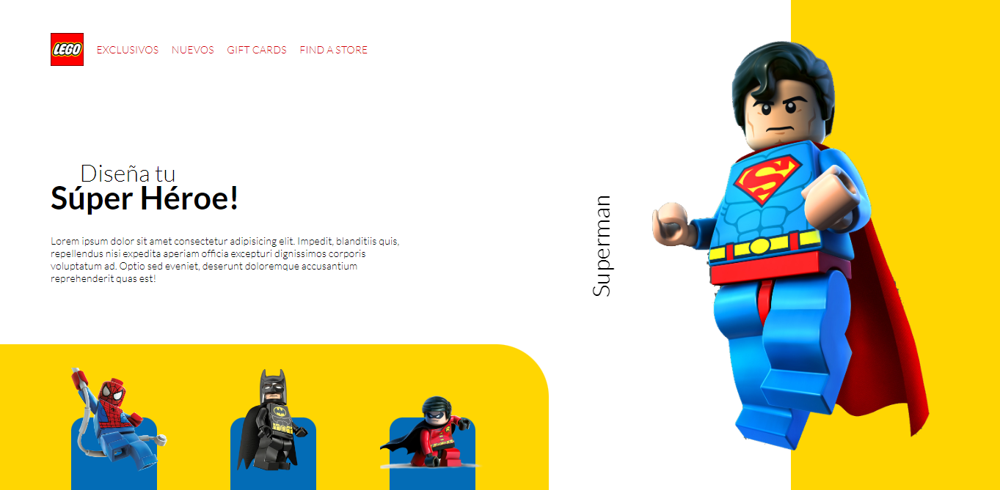

# Lego Website

## Welcome! 👋

This is a project of Lego where I implemented CSS animations and transitions to add effects to the web page.

## Links!

  - Solution URL: https://mauricioc12.github.io/Lego-Website-Project/
  
## My process

Learn how to use CSS animations and transitions and know how to implement them in my project needs.

## Built with: 

- Semantic HTML5 markup
- CSS custom properties, animations and transitions
- Responsive design
